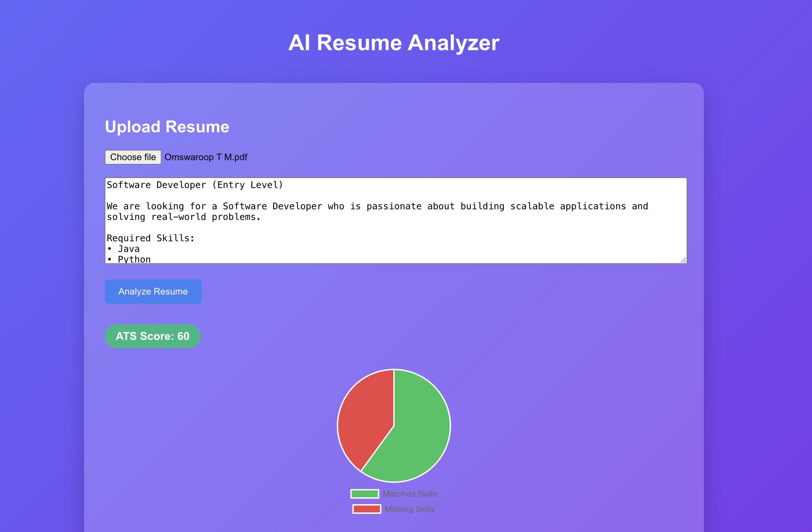
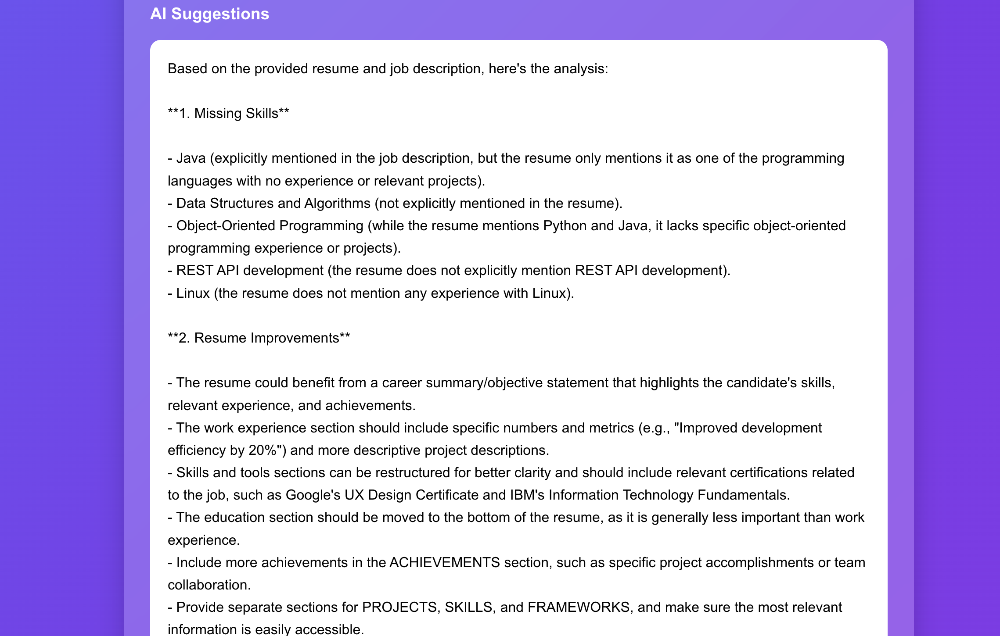
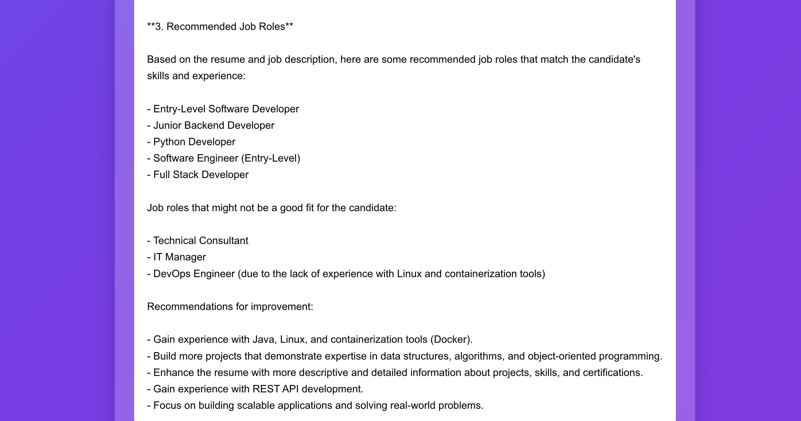
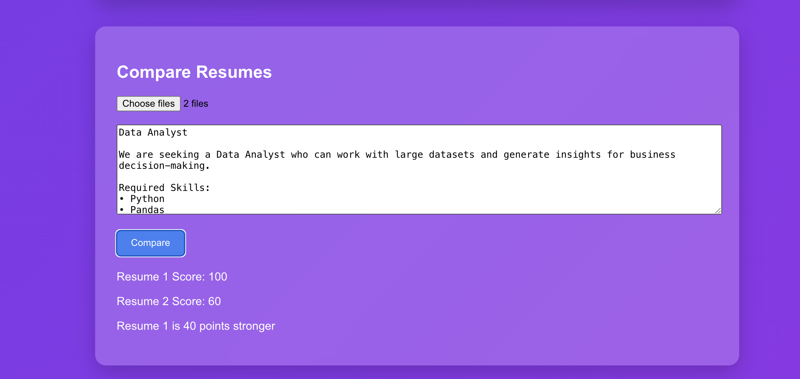

# AI Resume Analyzer

AI-powered web application that analyzes resumes using ATS scoring, skill matching, and AI-based suggestions.

## Features
- Upload PDF resumes
- ATS score calculation
- Skill extraction
- Matched and missing skills detection
- AI-powered resume improvement suggestions
- Resume comparison system
- Visualization using charts

## Tech Stack

Frontend
- React.js
- Axios
- Chart.js

Backend
- Node.js
- Express.js
- MongoDB

AI Integration
- Groq API (Llama 3)

## How to Run

### Backend
cd backend  
npm install  
node server.js  

### Frontend
cd frontend  
npm install  
npm start  

## Screenshots

### Resume Upload & ATS Score Analysis
This screen allows users to upload a resume and paste a job description.  
The system calculates an **ATS score** and visualizes matched vs missing skills using a chart.

---

### Skill Matching Analysis
The system extracts skills from the resume and job description and displays:

- Matched skills
- Missing skills

This helps users understand **what skills they need to improve**.

---

### AI Resume Suggestions (Part 1)
The AI analyzes the resume and provides:

- Missing skill insights
- Resume improvement suggestions
- Industry recommendations

---

### AI Resume Suggestions (Part 2)
Additional AI insights include:

- Recommended job roles
- Career improvement suggestions
- Technical skills to learn next

---

### Resume Comparison Feature
Users can upload **two resumes** and compare them against the same job description.

The system calculates:

- Resume 1 ATS Score
- Resume 2 ATS Score
- Strength difference between resumes

